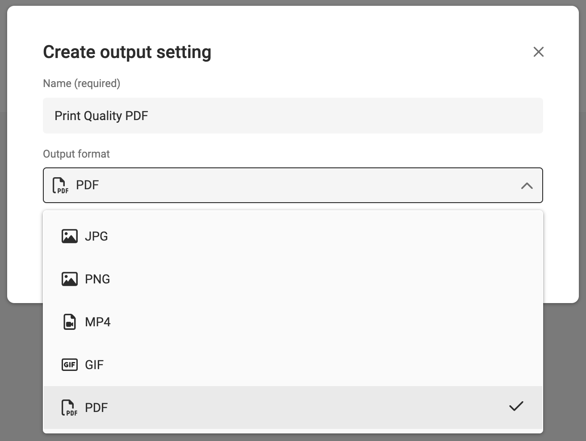
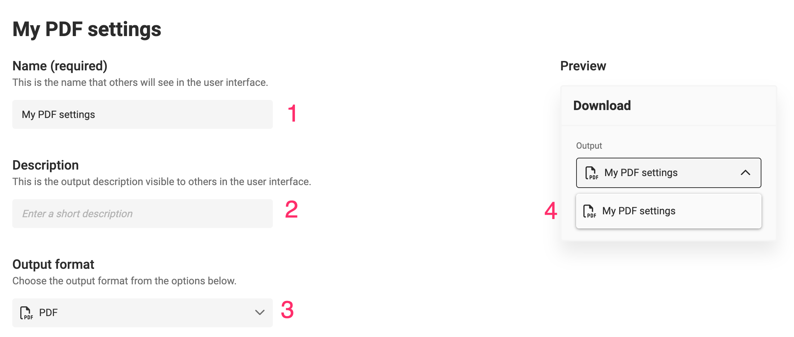
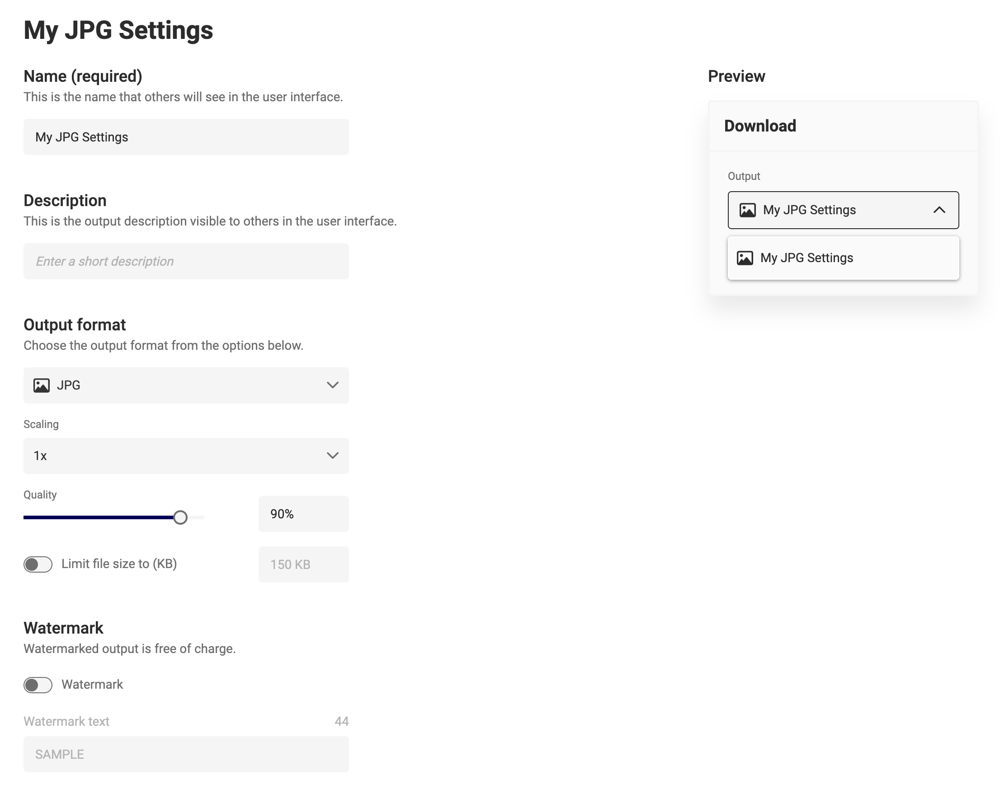
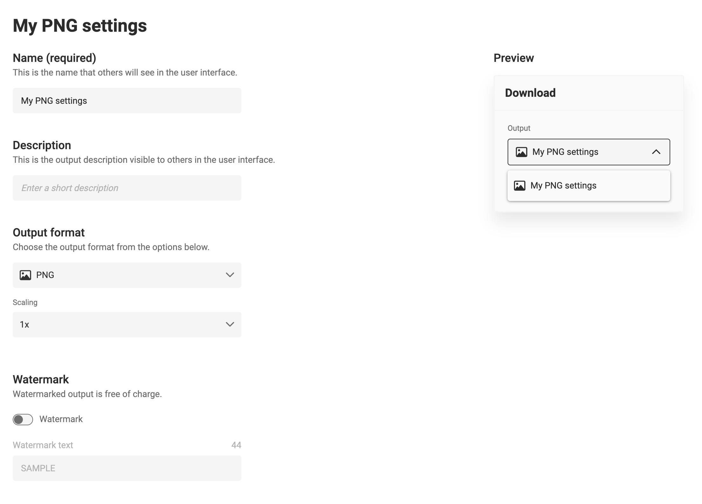
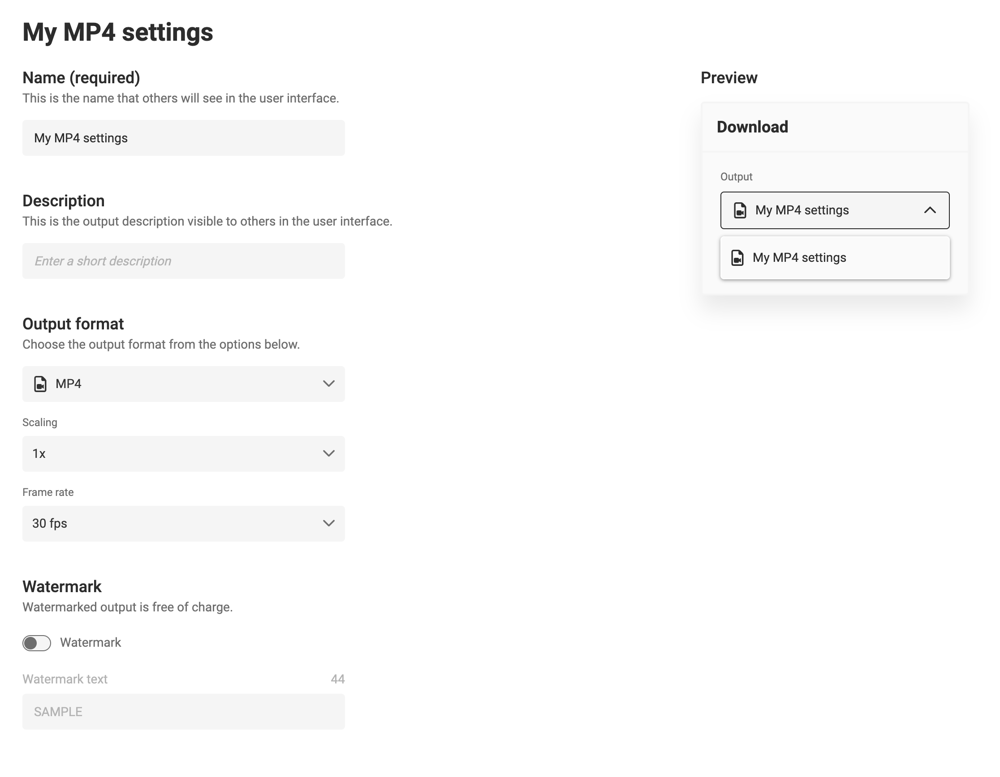

# Create Output Settings

[What are output settings?](/GraFx-Studio/concepts/output-settings/)

## Create output settings

In the GraFx Studio application, under manage, you can manage "Output settings"

To add a setting click the "+ create" button.

Give your setting a relevant name, and choose the output file format.

The created setting will appear in the list.

You can delete a setting, at the "..." menu at the right of the list.

Depending on the chosen output file type, there are different settings available.

## Generic settings for all file types

### Name and description

The name of your setting (1), is the name that will be shown in the [Studio UI](/GraFx-Studio/guides/create-projects/#customize-your-project).

The description (2) will be shown as a tooltip, when hovering over the output setting in the Studio UI (4).

### Output format

The output format (3) is the chosen file type. You can still change it in the settings detail.

### Watermark

When checked, your output will have a visual watermark, and the output will not count as a render.

Add a word that will be used as the visual watermark. The word cannot be empty.

## PDF output settings

See [generic settings](#generic-settings-for-all-file-types)

## JPG output settings

### Scaling

Defines how much times the original size of the files needs to be at output, when using this setting.

### Quality

Set the quality of the output file. The higher the quality, the larger the file will be.

If you choose to set the file size limit, the Quality will fade. Since you'll leave it to our engine, to find the best quality just below the file size you set.

## PNG output settings

### Scaling

Defines how much times the original size of the files needs to be at output, when using this setting.

## GIF output settings

### Scaling

Defines how much times the original size of the files needs to be at output, when using this setting.

### Frame rate

For animations, defines how much frames will be played per second.

!!! warning
	For large sizes and big files, it might take a while to load all frames, before the full animation plays. Only when all frames are loaded, the full Frame rate will be visible.
	The actual frame rate playback can also be influenced on the speed of your browser and computer.
	The Frame rate is an indication, not a guarantee.

### File Size limit

If you choose to set the file size limit, the Quality will fade. Since you'll leave it to our engine, to find the best quality just below the file size you set.

Especially with (animated) gif files, this can mean the amount of used colors will lower to reach the desired file size.

## MP4 output settings

### Scaling

Defines how much times the original size of the files needs to be at output, when using this setting.

### Frame rate

For animations, defines how much frames will be played per second.